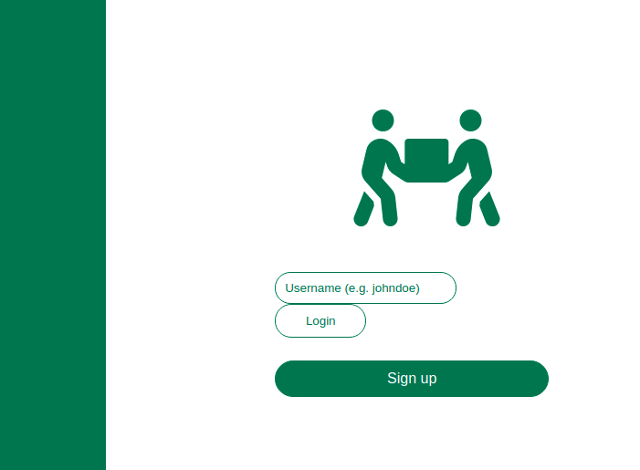
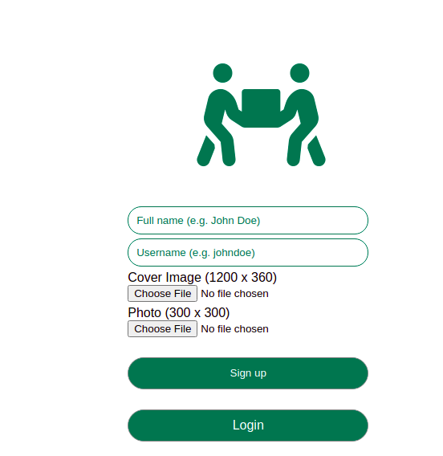
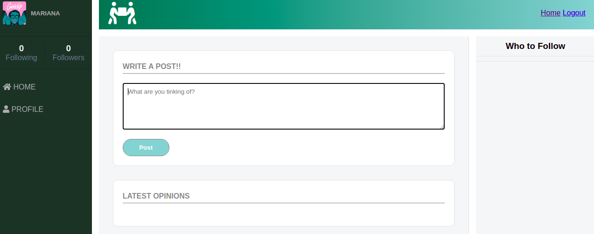

# Twitter-redesign
Capstone Project of the Ruby on Rails Curriculum in Microverse.

The project consisted of creating an MVP of an app that works similar to Twitter. With the implementation of the following functionalities:

- Users log in only with username (proper authentication was not a requirement).
- Before a user logs in they can only see the Log in/Sign up page.
- When they log in they have full access to the app.
- Users can post tweets.
- Users can follow other users.
- Users can unfollow other users.
- Users can add a profile photo and a profile cover image

Design: [Twitter Redesign](https://www.behance.net/gallery/14286087/Twitter-Redesign-of-UI-details), by [Gregoire Vella](https://www.behance.net/gregoirevella)

## N+1 Problem

In the application, each User has a collection of Followings objects. Another way to say this is:

- User → Following is a one-to-many relationship.
And then each Following has a User who is being followed by a given User.

In other words, you have one select for the Followings, and then N additional selects, where N is the total number of other users followed.

an example of this in the application is in the `users_controller.rb`

```ruby
def show
  @user = User.includes(followers: :follower, followings: :followed).find(@user.id)
  # ...
end
```

## You can access the social media [HERE](https://dry-sierra-52143.herokuapp.com/)

## login/ sign up 



##  sign up 



##  layout



## Built With

- Ruby (version 2.7.2)
- Ruby on Rails 

- Gems
  - gem 'pg'
  - gem 'rspec'
  
  ## Usage

Clone the repository to your machine and cd into the directory

- git clone git@github.com:atenaiis/Twitter-redesign.git
- cd Twitter-redesign
- rails db:create
- rails db:migrate
- rails s
Use the following command to start the rails server then visit: http://localhost:3000 to use the app

- rails s


## Authors

👤 **Atenais Campos**

- Github: [@atenaiis](https://github.com/atenaiis)
- Twitter: [@spranomarian](https://twitter.com/SopranoMarian)
- Linkedin: [linkedin](https://www.linkedin.com/in/mariana-atenai-campos-garcia-a30791143/)


## 🤝 Contributing

Contributions, issues and feature requests are welcome!

## Acknowledgments

- [Microverse](https://www.microverse.org/)
- [Gregoire Vella](https://www.behance.net/gregoirevella): for the design"


## Show your support

Give a ⭐️ if you like this project!

